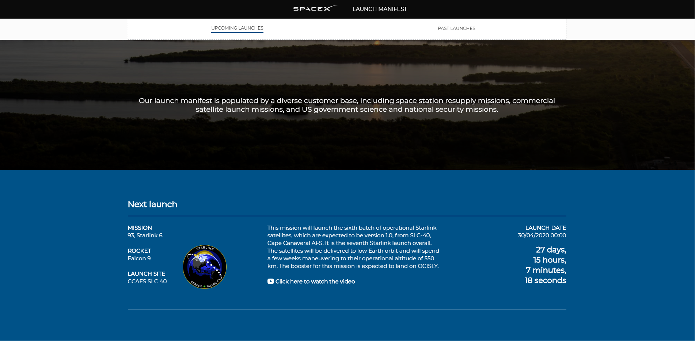
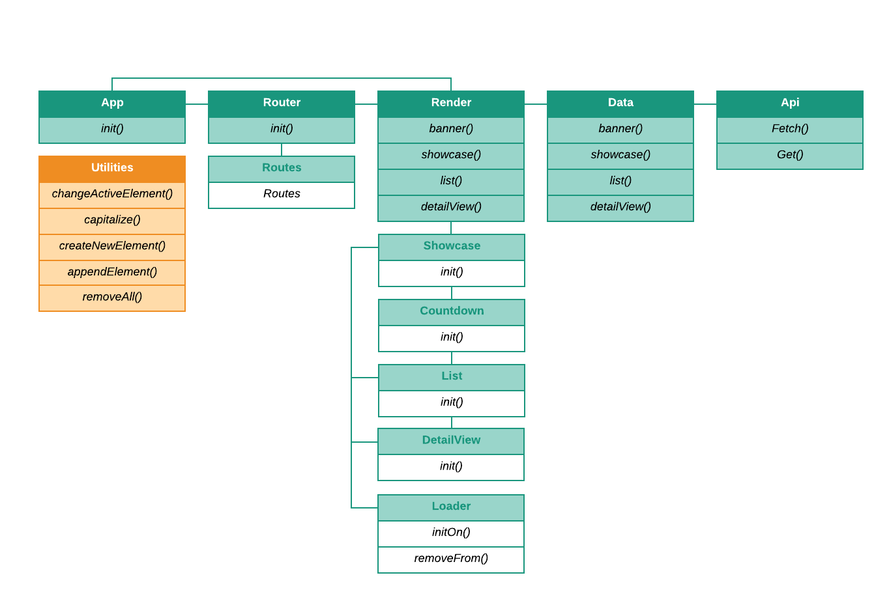
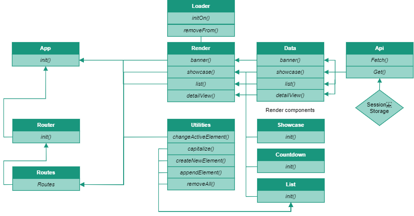
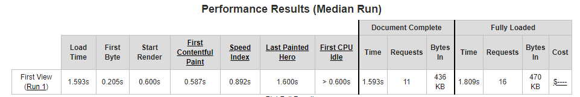
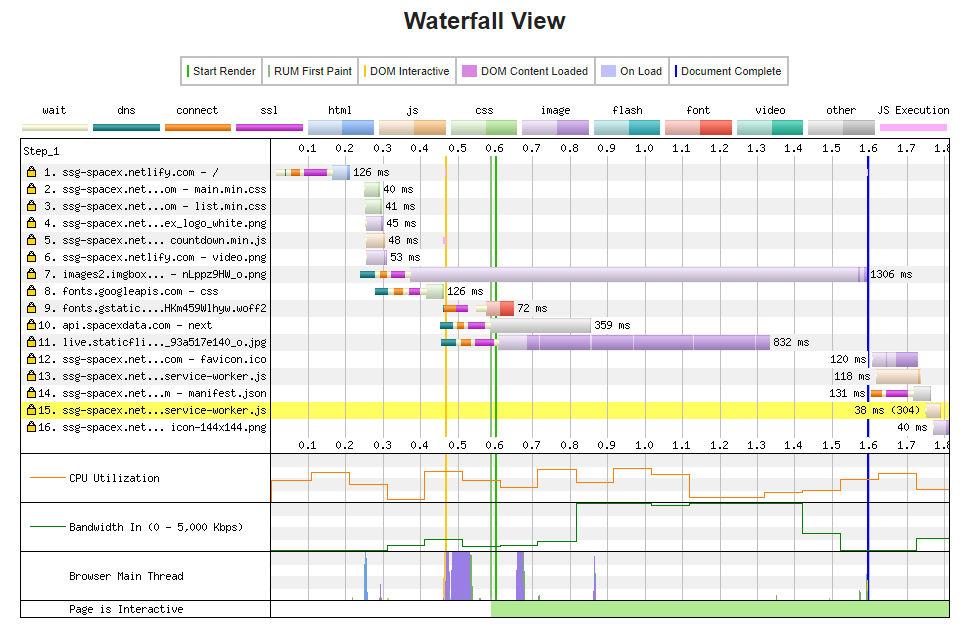
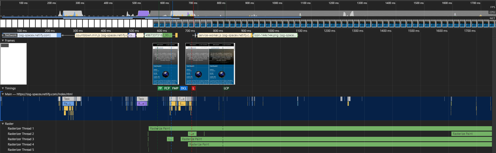

# SpaceX History

This application provides an overview of all past and upcoming SpaceX Rocket launches. On the one page it showcases the next launch with a countdown timer and some info on the mission, launch site and rocket type as well as a list of all upcoming launches. On the second page, it showcases the latest rocket launch as well as a list of all past launches. By clicking on any launch, more technical details can be revealed.

## Contents
1. [Installation](#Installation)
2. [Features](#Features)
3. [API](#API)
4. [Actors and Interactions](#Actors-and-Interactions)
5. [Dependencies](#Dependencies)
6. [Performance optimization](#Performance-optimization)
7. [Wiki](#wiki)
8. [Conclusions](#Conclusions)
9. [License](#License)

## Installation
To work on this project, 
1. First clone this repo with `git clone https://github.com/lennartdeknikker/progressive-web-apps-1920.git`. 
2. Install the necessary dependencies with `npm install`
3. Run `npm run dev` to build and serve the page.

That's it. You don't need to get an API key since SpaceX provides a public one.

## Features
This application features:
* [x] A banner image showing a picture of the latest launch
* [x] An element showcasing details on the next launch with a countdown timer. 
* [x] Toggling between past and future launches.
* [x] A list with detailed information on past and future launches.
* [x] Pages showing technical details for all launches.
* [ ] Search input to filter on launch data.

## API
This application uses the latest version of the SpaceX API.
### Base URL
`https://api.spacexdata.com/v3`
### Status
Check out the status of this API [here](https://status.spacexdata.com/)
### Authentication
It's a public API so no authentication is needed.
### Limits
The API has a rate limit of 50 req/sec per IP address, if exceeded, a response of 429 will be given until the rate drops back below 50 req/sec
### Caching
In general, the standard cache times are as follows:
- launches - 30 seconds
- ships, payloads, roadster - 5 minutes
- capsules, cores, launchpads, landpads - 1 hour
- dragons, rockets, missions, history, company info - 24 hours
### More information
https://docs.spacexdata.com/

## Actors and Interactions
### Actor diagram

### Interaction diagram

## Dependencies
### minification
- minify 5.1.1
- minify-css-stream 0.1.0
- minify-html-stream 0.3.1
- minify-stream 1.2.1

### Other
- node-fetch 2.6.0

### Development
- **To watch file changes**: chokidar-cli 2.1.0
- **Templating engine**: ejs 2.6.2
- **Linter**: eslint 6.8.0
- **file system changes**: fs-extra 8.1.0
- **to obtain file names**: glob 7.1.6
- **to combine multiple npm script commands**: npm-run-all 4.1.5

## Performance Optimization

### Static Site Generation
To give users the best experience browsing through this website, I wrote a script that renders all pages statically and just serve static content to the client. In addition to this static site generation using the .ejs templating engine, I applied minification, optimized the critical rendering path and added a service worker to decrease the necessary amount of server requests.

### Optimizing the critical rendering path
Javascript is blocking. That means that when a page is loaded and Javascript is the first thing it needs to load, this will delay loading other elements until that script is finished. To not compromise the critical rendering path this way, I put the client side scripts at the bottom of the page. As it's not vital for rendering the page, and it's just there to improve user experience it's not necessary to load the scripts before rendering the page.

### Minification
To increase performance on the time it takes to load files, I applied minification. I thought it would be nice to write my own scripts doing just that instead of using build tools like webpack or gulp, so I wrote a script called `minify.js` that uses multiple microlibraries to first minify the javascript files, then minify the CSS and then minify the html files.

### Gzip
Another way to improve performance would be to compress the files on the server using gzip. I didn't manage to apply that functionality just yet, but that would be the next step to work on.

### Images
To increase performance, it would be better to convert the used images to the `.webp` format. I didn't manage to do that in time, so I'll work on that later.

### Service worker
I Implemented a service worker, to cache files and make the website load faster. It intercepts all fetch requests, checks if the requested data is already stored in cache and if so serves it from there. If it's not there, it obtains the data and tries to save this in cache storage for the next time the page is loaded. This way it's also possible to use the application offline.

### Used tools & Test results
#### Webpagetest.org
This tool tests the performance of a webpage, shows the results and provides useful tips to increase performance.

#### Lighthouse

##### Performance

## Wiki
For more details on the performance optimizations I applied, please check out [this wiki page](https://github.com/lennartdeknikker/progressive-web-apps-1920/wiki/Performance-Optimization)
For more details on the application of a service worker, please check out [this wiki page](https://github.com/lennartdeknikker/progressive-web-apps-1920/wiki/Service-Worker-Implementation)

## Conclusions
### What I've learned
Working on this project once more made me realize there will always remain more to learn. Once you've mastered something, the always recurring sideeffect is that it shows more doors to other learning paths I didn't even know existed. That might sound exhausting and sometimes it's just overwhelming, but it also is what keeps this field of work interesting. 

As a result, a lot of times it seems not to be possible to actually finish a project, because there's always new steps to take to improve performance as well as the experience for the user. This is also true for this project. As of now, I don't think it is finished. I hope it's enough to pass this course for now, but I didn't get everything I wanted to work and I wouldn't mind improving some more if that's necessary.

## License
This project is licensed under the terms of the MIT license.
